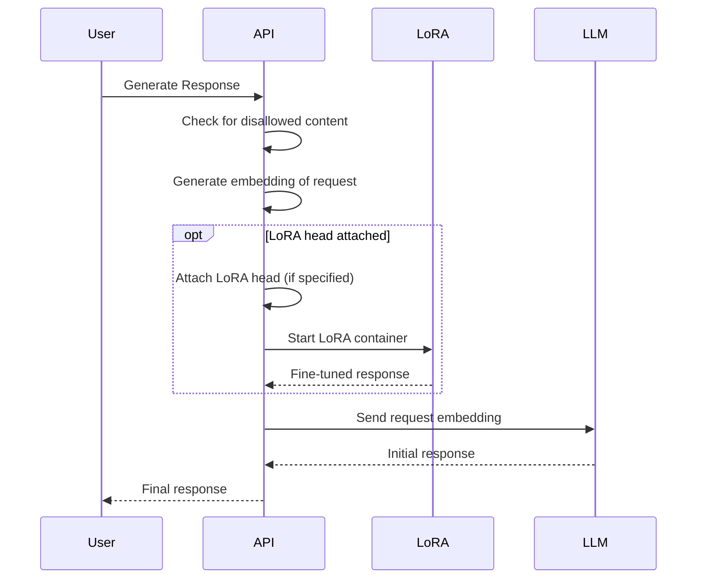

# UNCC Free LLM Usage API
Many students want to create and build applications using Large Language Models and they are at times costly.  Creating a student ran LLM api with exchangeable LoRA heads means we are able to get vastly different outputs and performance in real time while utilizing the same base models.  

# TODO: System Architecture and Requirements

## Functionality
- [ ] The API should be able to receive requests from users to generate responses.
- [ ] The API should have the ability to attach custom LoRA (Low-Rank Adaptation) heads to the Language Model (LLM) if specified by the user.
- [ ] The API should generate vector embeddings of the filtered user requests.
- [ ] The LLM container should be able to take the request embeddings as input and generate initial responses.
- [ ] The LoRA Head container should be able to fine-tune the initial responses from the LLM using the specified LoRA head (if attached).
- [ ] The final response (from the LLM and the LoRA Head container) should be sent back to the API.
- [ ] The API should return the final response to the user.

## System Requirements
- [ ] The API should be a RESTful API that can handle HTTP requests and responses.
- [ ] The API should have the following endpoints:
  - [ ] `POST /generate`: Endpoint for generating responses. Should accept the user request and LoRA head specification (if any) in the request body.
  - [ ] `POST /attach-head`: Endpoint for attaching a custom LoRA head to the LLM.
  - [ ] `POST /generate-embedding`: Endpoint for generating vector embeddings of user requests.
  - [ ] `GET /ping`: Endpoint for checking the health and availability of the API.
- [ ] The LLM container should be a scalable and highly available container or service capable of handling large language models.
- [ ] The LoRA Head container should be a separate container or service capable of running and applying the specified LoRA heads.
- [ ] The system should have a load balancer or reverse proxy to distribute incoming requests across multiple API instances.
- [ ] The system should implement appropriate security measures, such as request validation, rate limiting, and authentication/authorization mechanisms.
- [ ] The system should have monitoring and logging capabilities to track performance, errors, and usage statistics.